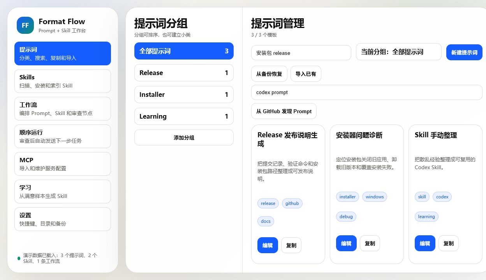
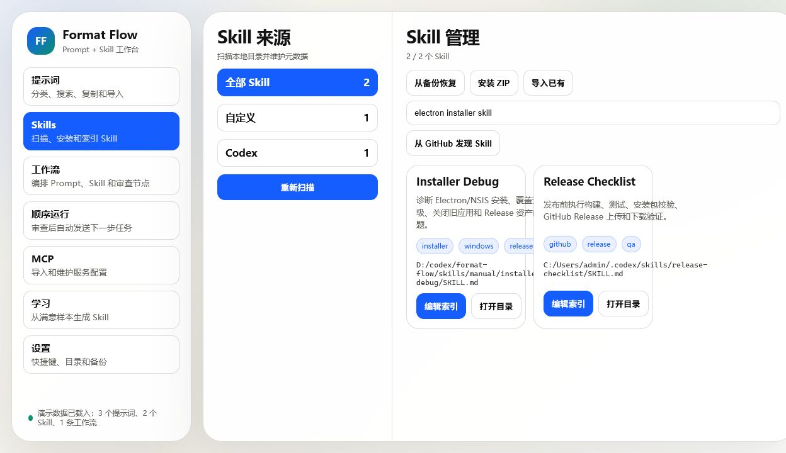
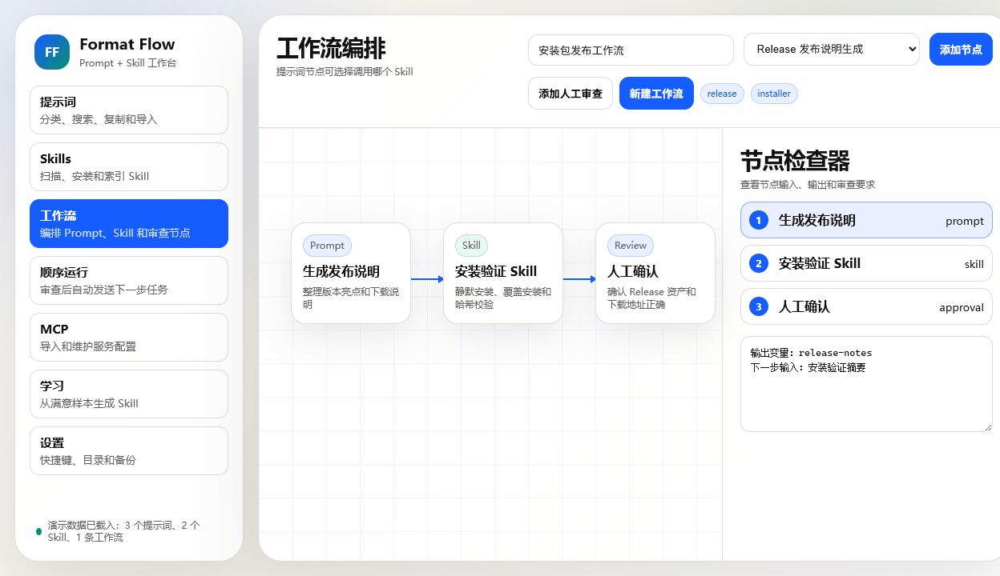
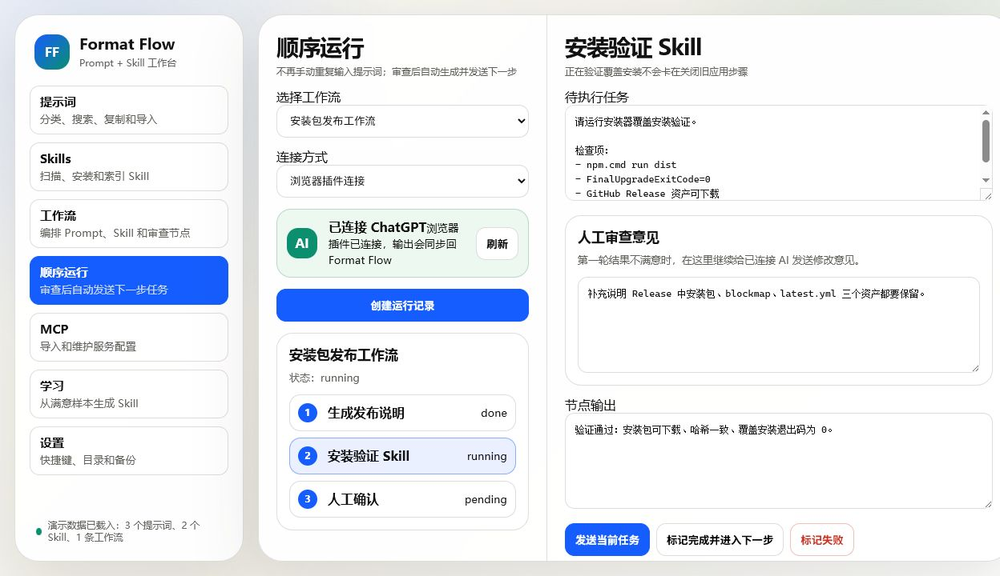
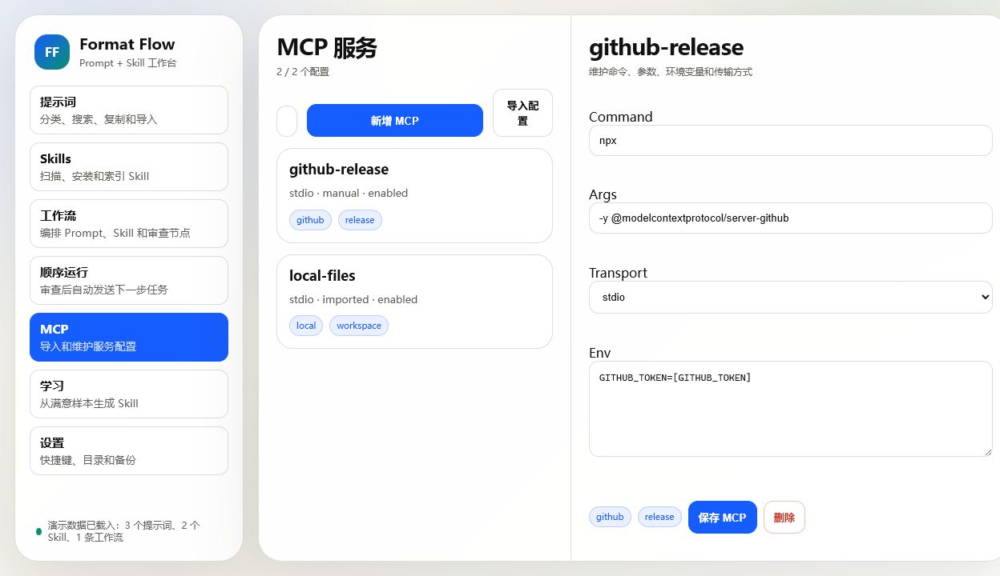
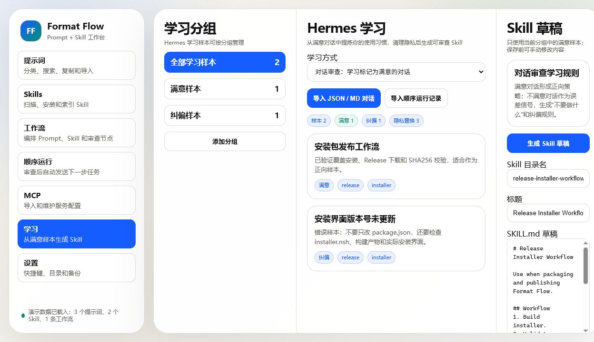
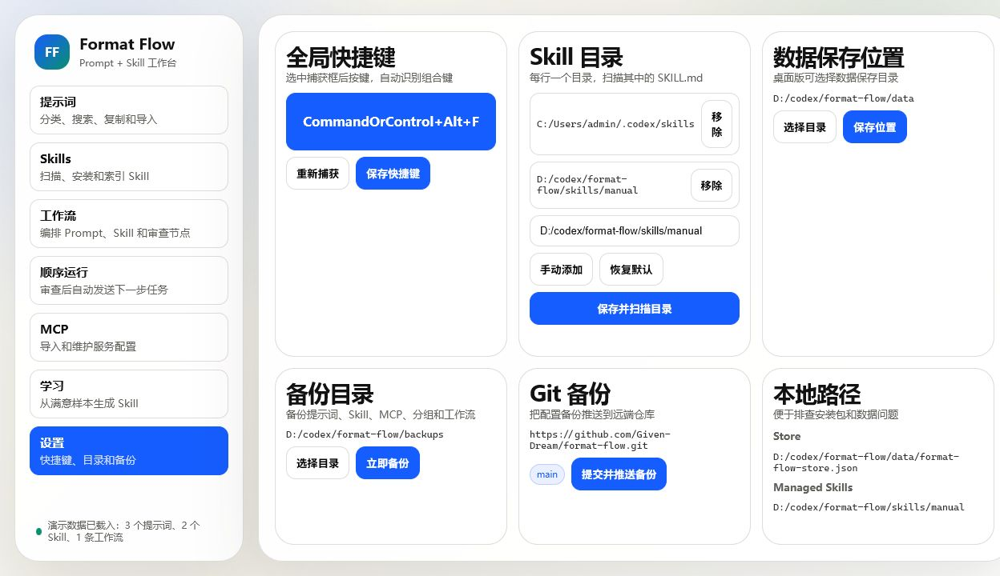

# Format Flow

Format Flow 是一个本地 Prompt 与 Codex Skill 工作流管理器。它把提示词、Skill、MCP 配置、人工审查和浏览器 AI 连接整理到一个桌面应用里，适合长期沉淀个人工作流。

## 下载

Windows 安装包见 [GitHub Releases](https://github.com/Given-Dream/format-flow/releases)：

- `Format-Flow-Setup-0.1.3.exe`
- 安装器会随安装包复制 `browser-extension`，并在安装引导中打开插件目录和 Chrome/Edge 扩展管理页，按提示加载本地插件即可。
- 下载后直接运行安装即可。

## 功能展示

### 提示词管理

按标签和分组管理提示词，支持搜索、复制、导入、备份恢复和 GitHub Prompt 发现。



### Skill 管理

扫描本地 Codex Skill 目录，预览 `SKILL.md`，维护标签、摘要和来源，也支持 ZIP、备份和 GitHub 导入。



### 工作流编排

把 Prompt、Skill 和人工审查节点编排成可执行流程，明确每一步输入、输出和审查要求。



### 顺序运行

按工作流顺序生成当前任务文本，人工确认后发送给剪贴板或浏览器插件，并记录每一步输出。



### MCP 服务

集中维护 MCP 服务配置，支持手动添加、导入 JSON/TOML 配置、管理命令参数和环境变量。



### 学习生成 Skill

从满意对话和纠偏样本中提炼个人偏好，清理隐私信息后生成可审查的 `SKILL.md` 草稿。



### 设置与备份

配置全局快捷键、Skill 目录、数据保存位置、本地备份目录和 Git 备份仓库。



## 主要功能

- 提示词 CRUD、标签搜索、变量识别、收藏和分组管理。
- 从备份、本地 Markdown/JSON/TXT、GitHub 导入提示词。
- 扫描本机 Codex Skill 目录，只读预览 `SKILL.md`，支持自定义标签和摘要覆盖。
- 从备份、ZIP、本地目录、GitHub 安装或导入 Skill。
- 使用流程图编排提示词、Skill 和人工审查节点。
- 顺序运行工作流，保存每个节点的输入、输出、状态和审查结果。
- 支持剪贴板连接和浏览器插件连接，把任务发送到主流 AI 网页输入框。
- 管理 MCP 服务配置，支持手动添加和 JSON/TOML 导入。
- 全局快捷键呼出/隐藏窗口，默认 `CommandOrControl+Alt+F`。
- 本地备份和 Git 备份，便于长期维护个人工作流资产。

## 开发命令

```powershell
npm.cmd install
npm.cmd run dev
npm.cmd run test
npm.cmd run build
npm.cmd run dist
```

数据默认保存在 Electron `userData` 目录下的 `format-flow-store.json`。桌面版也可以在设置页选择自定义数据目录。
