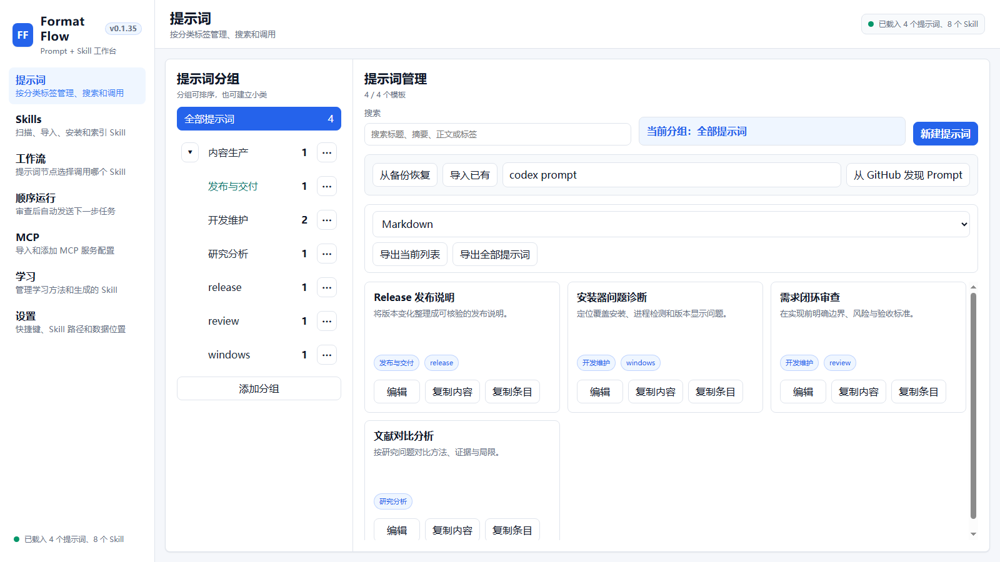
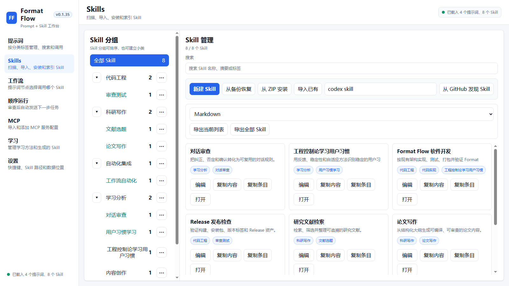
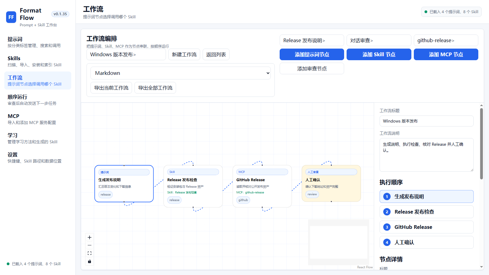
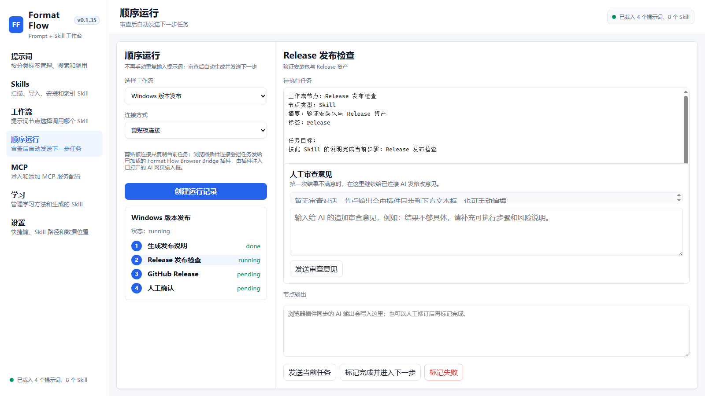
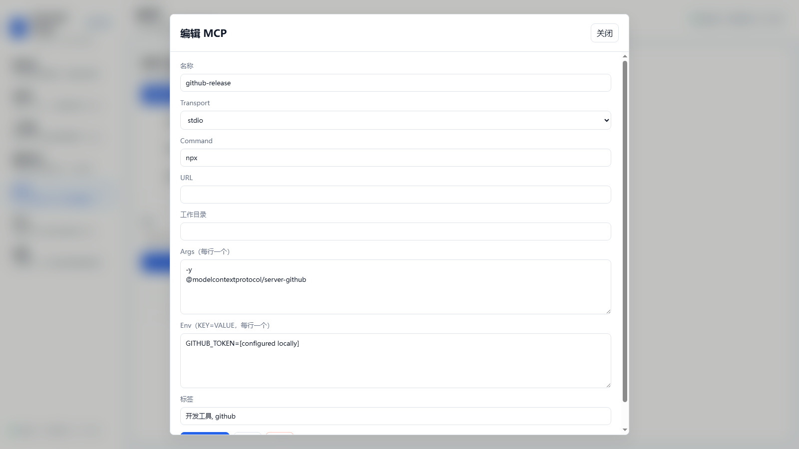
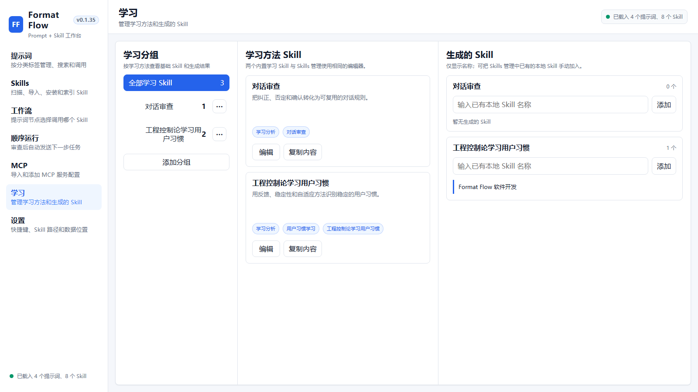
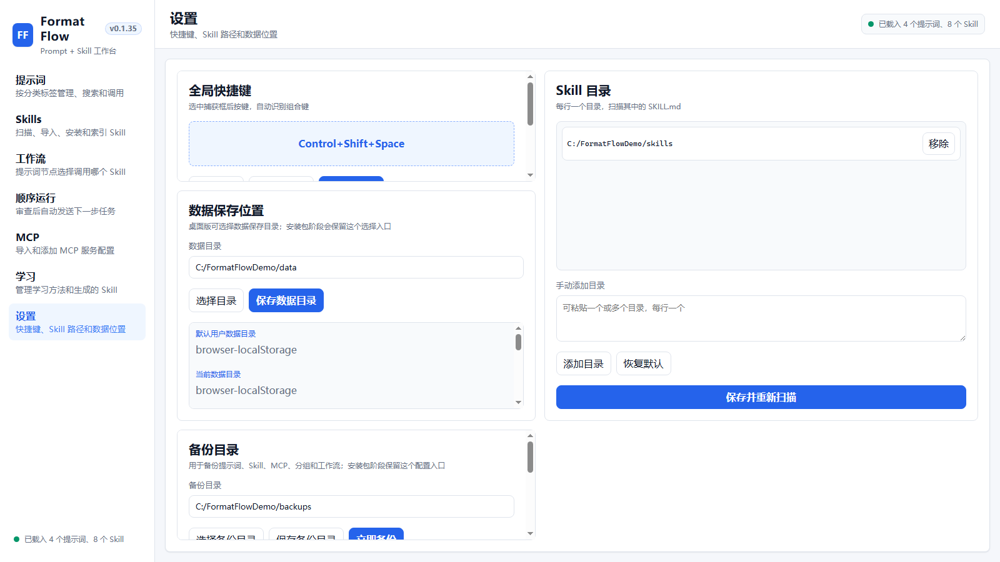

# Format Flow

Format Flow 是一个面向长期使用的 Windows 本地 Prompt、Skill、工作流与 MCP 管理器。它将分散在文件、Codex 目录和浏览器中的 AI 工作资产集中管理，并通过快捷调用、变量填充、顺序运行、导入导出和备份形成可复用的个人工作流。

当前版本：`v0.1.40`，历史版本无密钥，若使用新版请联系作者。

## 下载与安装

- [下载 Format Flow v0.1.40 Windows 安装包](https://github.com/Given-Dream/format-flow/releases/download/v0.1.40/Format-Flow-Setup-0.1.40.exe)
- 管理员 License Manager 不放在公开 Release，授权管理员请通过私有仓库获取。
- [查看最新 Release](https://github.com/Given-Dream/format-flow/releases/latest)
- 支持 Windows 10/11 x64，下载后直接运行安装程序。
- Release 同时提供 `.blockmap` 和 `latest.yml`，便于分发安装包及其版本元数据。
- 当前安装包未使用商业代码签名证书，Windows SmartScreen 可能显示安全确认。请从本仓库 Release 页面下载并核对来源。

浏览器插件已经包含在安装目录的 `resources/browser-extension` 中。安装引导会打开插件目录和 Chrome/Edge 扩展管理页；浏览器安全策略仍要求用户开启开发者模式并手动选择“加载已解压的扩展程序”。不安装插件也可以使用剪贴板复制模式。

## 使用流程

1. 在提示词、Skills 和 MCP 中建立可复用资源。
2. 使用标签与多级分组整理资源，或让扫描到的 Skill 自动进入语义分类。
3. 在工作流中按顺序组合 Prompt、Skill、MCP 和人工审查节点。
4. 通过全局键盘快捷键或鼠标侧键打开快捷调用。
5. 遇到 `【请填写：xx】` 或 `{{variable}}` 时，先完成变量表单再复制或运行。
6. 使用剪贴板或浏览器插件连接 AI 网页，并通过本地/Git 备份长期保存数据。

## 从 v0.1.1 到当前版本

README 已按当前代码重写，不再沿用 `v0.1.1` 时仅覆盖基础功能的说明。后续版本的主要演进如下：

| 版本阶段 | 主要变化 |
| --- | --- |
| `v0.1.1` - `v0.1.12` | 在安装器和界面展示版本号；加入分组重命名、同名隔离、子级归类、空分组过滤、条目复制粘贴、父级汇总、折叠和拖拽层级。 |
| `v0.1.13` - `v0.1.20` | 加入鼠标侧键快捷调用、手动创建 Skill、响应式操作布局、带标签导出、快捷窗口定位修复和自定义变量填充。 |
| `v0.1.21` - `v0.1.26` | 快捷调用支持多级分组和记忆上次位置；改为安全的剪贴板复制；Markdown 可按条目恢复；删除操作增加确认；Skill 与工作流补齐复制、收藏、编辑和导出。 |
| `v0.1.27` - `v0.1.32` | 工作流改用可检索的分层资源选择器，Prompt、Skill、MCP 成为真实节点；节点变量会在运行前填充；修复重复弹窗；Skill 编辑器支持完整目录预览与维护。 |
| `v0.1.33` - `v0.1.35` | 加入工程控制论用户习惯学习 Skill 及生成 Skill 管理；清理重复/路径噪声标签；按 Skill 语义自动建立父子分类并支持父级汇总；补齐 Windows Release 自动构建流程。 |
| `v0.1.36` - `v0.1.37` | 改善顺序运行在窄窗口中的滚动与操作布局；浏览器插件支持在弹窗中授权、管理和动态连接自定义 AI 网站域名。 |
| `v0.1.38` | 快捷调用记住各模式的搜索、分组和上次填写的自定义变量；加入机器码绑定的永久授权和管理员授权管理器。 |
| `v0.1.39` | 更换节点流应用图标；提示词正文编辑器加入查找定位、区分大小写、当前替换和全部替换。 |
| `v0.1.40` | 将节点流图标显示到应用内品牌区域；查找结果会自动选中并滚动正文到关键词所在行。 |

## 功能展示

### 提示词管理

提示词支持新建、编辑、搜索、收藏、删除、复制内容和复制条目。分组可以建立多级子类、折叠、重命名、排序和拖拽移动；在子级中创建的提示词会保留在对应分组，父级会汇总显示所有子级内容。



支持从 Markdown、TXT、JSON、备份文件和 GitHub 搜索结果导入。Markdown 导出包含标签和结构化备份注释，再次导入时会恢复为独立条目，而不是合并成一条提示词。删除提示词或分组前会显示影响范围并要求确认。

### Skill 管理

Format Flow 可以扫描 Codex Skill 目录、应用托管目录和用户指定目录。扫描时根据 `name`、`description`、标题与 frontmatter 标签进行语义分类，不会再将用户名、`AppData` 或目录层级误识别为标签。

自动分类包含代码工程、科研实验、科研写作、内容创作、自动化集成、学习分析和行业专业等父级，父级会汇总子级 Skill。用户明确设置的标签优先保留，历史路径噪声和旧版批量误分类会在显示时清理。



每个 Skill 都可以预览和维护完整目录结构：

- `SKILL.md`
- `agent/openai.yaml`
- `scripts`
- `references`
- `assets`
- `extras`

文本文件可以直接预览、滚动查看和编辑；目录可以打开到本地位置。缺少的标准文件或目录会显示为 `none`。Skill 还支持手动创建、复制内容、复制条目、收藏、删除确认，以及从备份、ZIP、本地目录和 GitHub 导入。

### 工作流编排

工作流不是孤立的文本节点。每个节点都可以直接绑定现有 Prompt、Skill 或 MCP，也可以加入人工审查步骤，从而把资源串联成可顺序运行的任务。



资源选择器使用弹窗展示层级分组，并支持直接检索。节点可以调整顺序和重新绑定资源；工作流本身支持标签管理、复制内容、复制条目、自定义变量、收藏、删除和 Markdown/TXT/JSON 导出。

### 快捷调用与变量填充

快捷调用支持提示词、Skill 和工作流三种模式，展示多级分组并记住上次选择的位置。空分组不会显示，父级可以继续进入子级查找内容。

可以使用全局键盘组合键或鼠标侧键打开快捷窗口。设置页会提供推荐快捷键，并在注册失败或可能冲突时给出提示。选择条目后内容会复制到剪贴板，不会主动缩小目标网页或强制发送消息。

当 Prompt、Skill 或工作流节点中出现 `【请填写：字段】` 或 `{{field}}` 时，会先弹出自定义填充表单，完成后再生成最终内容。

### 顺序运行

顺序运行按照工作流节点生成当前任务，保存每一步的输入、输出、状态和人工审查结果。节点中的 Prompt、Skill 和 MCP 内容会参与实际执行文本，而不是只显示节点名称。



连接方式包括：

- **剪贴板连接**：复制当前任务，由用户决定粘贴位置和发送时机。
- **浏览器插件连接**：通过本机 `127.0.0.1` 桥接服务，将任务填入已打开的受支持 AI 网页输入框。

### MCP 服务

MCP 页面集中维护服务名称、传输方式、命令、参数、工作目录、URL、环境变量、启用状态和标签。支持手动添加，以及从 JSON/TOML 配置导入。



工作流资源选择器可以直接选择 MCP 节点，导出工作流时也会附带相关 MCP 配置。

### 学习方法与生成 Skill

学习页以 Skill 管理方式展示两个内置方法：

- **对话审查**：从错误信号、纠正要求和人工确认中形成可复用规则。
- **工程控制论学习用户习惯**：使用系统边界、状态、反馈、扰动、时滞、稳定性、自适应和容错等方法识别稳定习惯。



两个基础 Skill 可以使用与 Skills 页面相同的完整编辑器和复制功能。带有 `generate by: conversation-review` 或 `generate by: engineering-cybernetics` 的生成 Skill 会自动归入对应学习方法；也可以从已扫描的 Skills 中手动添加关联结果。

### 设置、数据与备份

设置页用于管理全局快捷键、鼠标快捷键、Skill 扫描目录、浏览器插件位置、数据保存位置、本地备份目录和 Git 备份仓库。



数据默认位于 Electron `userData` 目录，Windows 通常为：

```text
%APPDATA%\format-flow
```

主要数据按用途分开保存：

```text
format-flow-store.json   应用索引、设置、分组与运行记录
prompts/                 提示词数据
workflows/               工作流数据
managed-skills/          Format Flow 托管的 Skill
backups/                 默认本地备份目录
```

用户可以在设置页切换自定义数据目录。备份支持写入本地 JSON，也可以提交并推送到用户配置的 Git 仓库。提示词、Skill 和工作流还可以分别导出为 Markdown、TXT 或 JSON，用于迁移和长期归档。

## 浏览器插件

插件源码位于 [`browser-extension`](browser-extension)，通过本机端口 `48174` 与桌面应用通信。当前适配 ChatGPT、Claude、Gemini、DeepSeek、Kimi、Qwen、Perplexity、Poe 和 Grok。点击浏览器工具栏中的插件图标，可以授权并管理自定义 AI 网站域名；自定义网站使用通用输入、发送和输出识别规则。是否自动发送由 Format Flow 当前调用模式决定。

安装步骤：

1. 打开 `chrome://extensions` 或 `edge://extensions`。
2. 开启“开发者模式”。
3. 点击“加载已解压的扩展程序”。
4. 选择 Format Flow 安装目录下的 `resources/browser-extension`。
5. 更新插件文件后，在扩展管理页点击一次“重新加载”。

## 开发

环境要求：Windows、Node.js 22+、npm。

```powershell
npm.cmd ci
npm.cmd run dev
npm.cmd run web:dev
npm.cmd run test
npm.cmd run build
npm.cmd run dist -- --publish never
```

常用目录：

```text
src/main/                 Electron 主进程、扫描、文件与系统集成
src/preload/              安全 IPC 桥接
src/renderer/src/         React 界面
src/shared/               类型、解析、分类和工作流领域逻辑
browser-extension/        Chrome/Edge 本地桥接插件
resources/built-in-skills 内置学习 Skill 模板
build/                    NSIS 安装器扩展
```

测试包括领域逻辑单元测试、浏览器插件选择器检查和连接检查。Windows 安装包由 Electron Builder + NSIS 生成，GitHub Actions 工作流会将安装包、`.blockmap` 与 `latest.yml` 发布到对应 Tag 的 Release。
